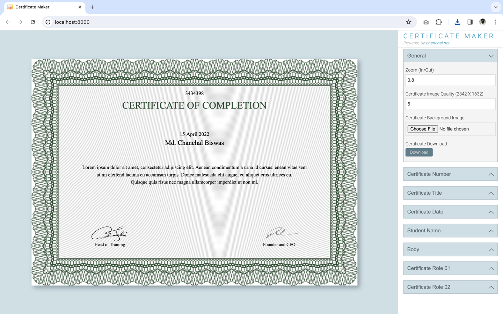

# Academic Certificate Maker

This class is designed for generating academic certificates. It is tailored for a specific certificate format and 
includes methods and properties necessary for certificate generation.

Used only `HTML`, `CSS` and `Javascript`

### Screenshot

